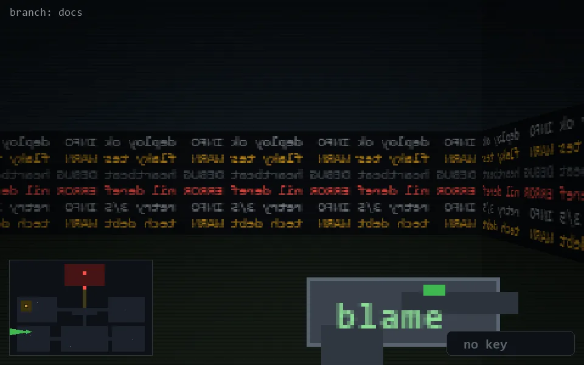

<!-- node:x05y19W -->
### `branch: docs` · 📍 (5, 19) · facing W · 🔑 —

|      |      |      |
|:----:|:----:|:----:|
|      | [⬆️](x04y19W.md) |      |
| [⬅️](x05y19S.md) | [💥](x05y19W.md) | [➡️](x05y19N.md) |
|      | [⬇️](x06y19W.md) |      |

[⌂ index](../README.md)
