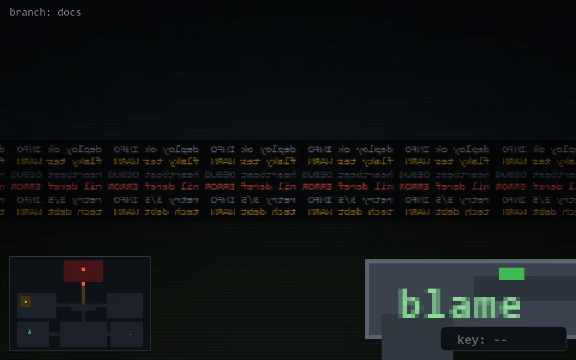

<!-- node:x05y20S -->
### `branch: docs` · 📍 (5, 20) · facing S · 🔑 —

|      |      |      |
|:----:|:----:|:----:|
|      | [⬆️](x05y21S.md) |      |
| [⬅️](x05y20E.md) | [💥](x05y20S.md) | [➡️](x05y20W.md) |
|      | [⬇️](x05y19S.md) |      |

[⌂ index](../README.md)
