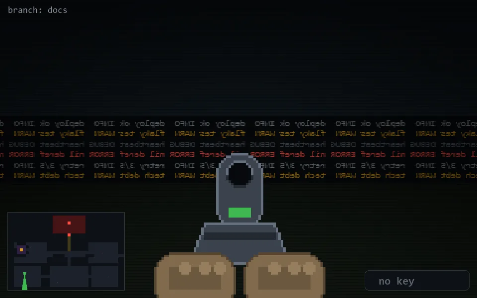

<!-- node:x05y20Sd -->
### `branch: docs` · 📍 (5, 20) · facing S · 🔑 — · ✖ bug deleted (it will be back)

|      |      |      |
|:----:|:----:|:----:|
|      | [⬆️](x05y21Sd.md) |      |
| [⬅️](x05y20Ed.md) | [💥](x05y20Sd.md) | [➡️](x05y20Wd.md) |
|      | [⬇️](x05y19Sd.md) |      |

[⌂ index](../README.md)
