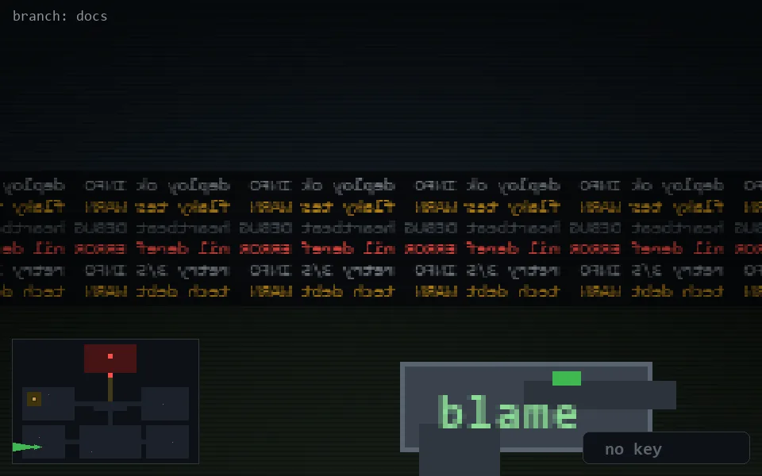

<!-- node:x05y22W -->
### `branch: docs` · 📍 (5, 22) · facing W · 🔑 —

|      |      |      |
|:----:|:----:|:----:|
|      | [⬆️](x04y22W.md) |      |
| [⬅️](x05y22S.md) | [💥](x05y22W.md) | [➡️](x05y22N.md) |
|      | [⬇️](x06y22W.md) |      |

[⌂ index](../README.md)
