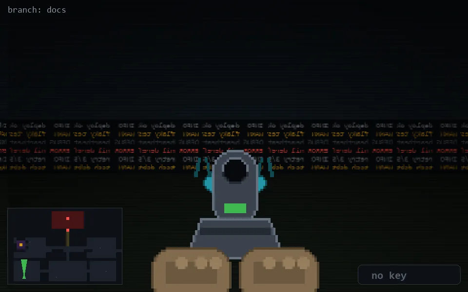

<!-- node:x05y23Nd -->
### `branch: docs` · 📍 (5, 23) · facing N · 🔑 — · ✖ bug deleted (it will be back)

|      |      |      |
|:----:|:----:|:----:|
|      | [⬆️](x05y22Nd.md) |      |
| [⬅️](x05y23Wd.md) | [💥](x05y23Nd.md) | [➡️](x05y23Ed.md) |
|      | [⬇️](x05y24Nd.md) |      |

[⌂ index](../README.md)
