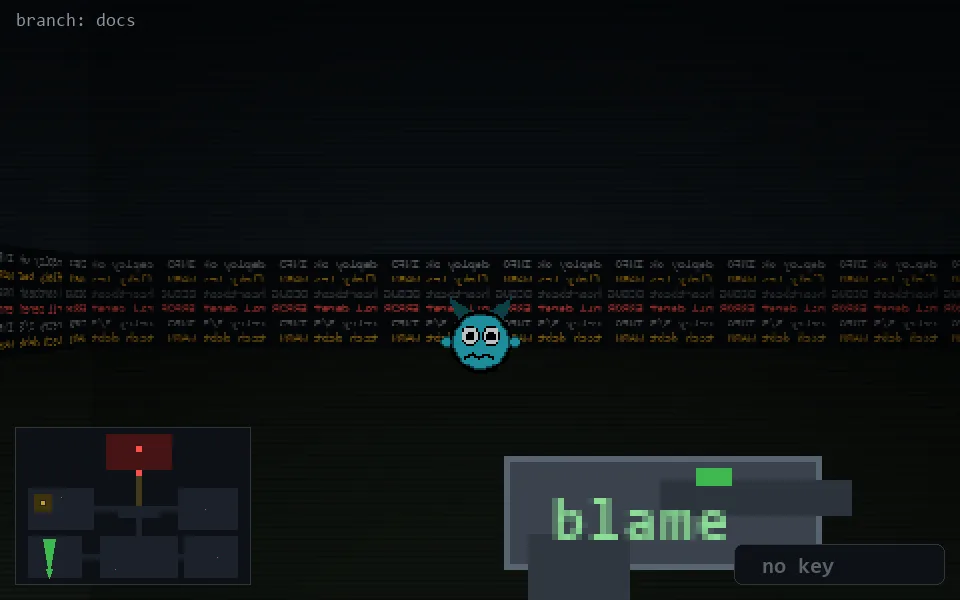

<!-- node:x05y24N -->
### `branch: docs` · 📍 (5, 24) · facing N · 🔑 —

|      |      |      |
|:----:|:----:|:----:|
|      | [⬆️](x05y23N.md) |      |
| [⬅️](x05y24W.md) | [💥](x05y24Nd.md) | [➡️](x05y24E.md) |
|      | ⛔️ |      |

[⌂ index](../README.md)
