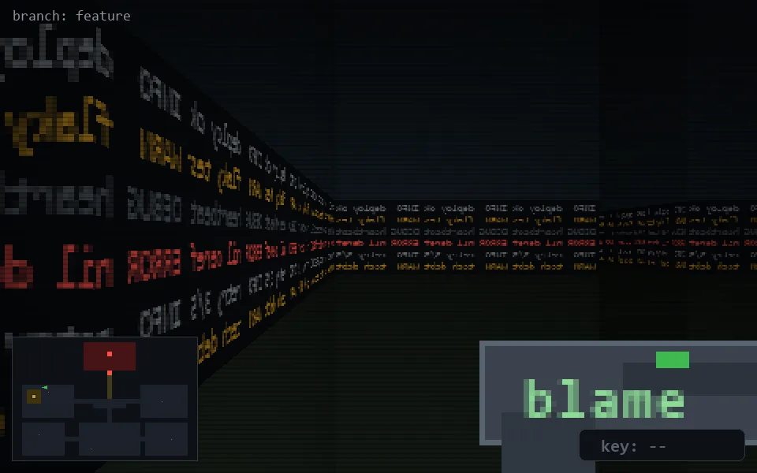

<!-- node:x06y10E -->
### `branch: feature` · 📍 (6, 10) · facing E · 🔑 —

|      |      |      |
|:----:|:----:|:----:|
|      | [⬆️](x07y10E.md) |      |
| [⬅️](x06y10N.md) | [💥](x06y10Ed.md) | [➡️](x06y10S.md) |
|      | ⛔️ |      |

[⌂ index](../README.md)
