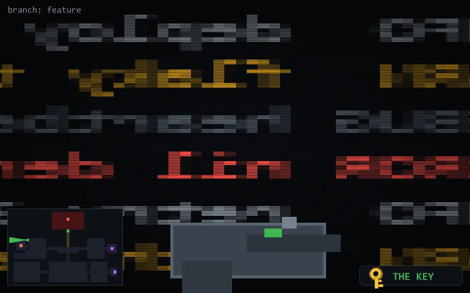

<!-- node:x06y10Wk -->
### `branch: feature` · 📍 (6, 10) · facing W · 🔑 THE KEY

|      |      |      |
|:----:|:----:|:----:|
|      | ⛔️ |      |
| [⬅️](x06y10Sk.md) | [💥](x06y10Wk.md) | [➡️](x06y10Nk.md) |
|      | [⬇️](x07y10Wk.md) |      |

[⌂ index](../README.md)
