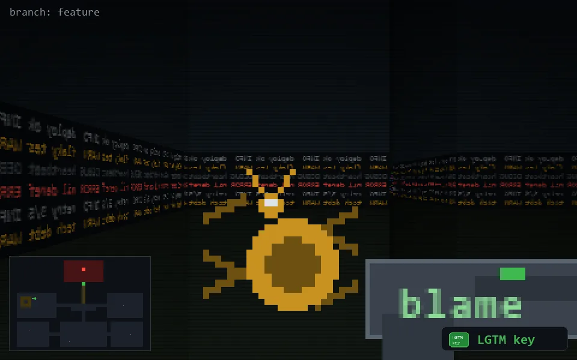

<!-- node:x06y11Ek -->
### `branch: feature` · 📍 (6, 11) · facing E · 🔑 THE KEY

|      |      |      |
|:----:|:----:|:----:|
|      | [⬆️](x07y11Ek.md) |      |
| [⬅️](x06y11Nk.md) | [💥](x06y11Ek.md) | [➡️](x06y11Sk.md) |
|      | [⬇️](x05y11Ek.md) |      |

[⌂ index](../README.md)
