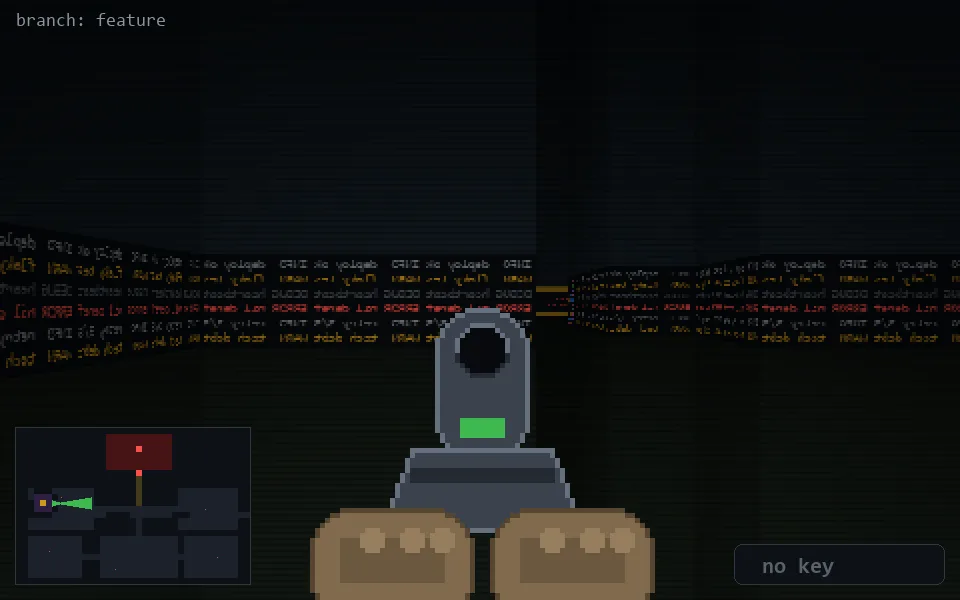

<!-- node:x06y12E -->
### `branch: feature` · 📍 (6, 12) · facing E · 🔑 —

|      |      |      |
|:----:|:----:|:----:|
|      | [⬆️](x07y12E.md) |      |
| [⬅️](x06y12N.md) | [💥](x06y12Ed.md) | [➡️](x06y12S.md) |
|      | [⬇️](x05y12Ew3.md) |      |

[⌂ index](../README.md)
