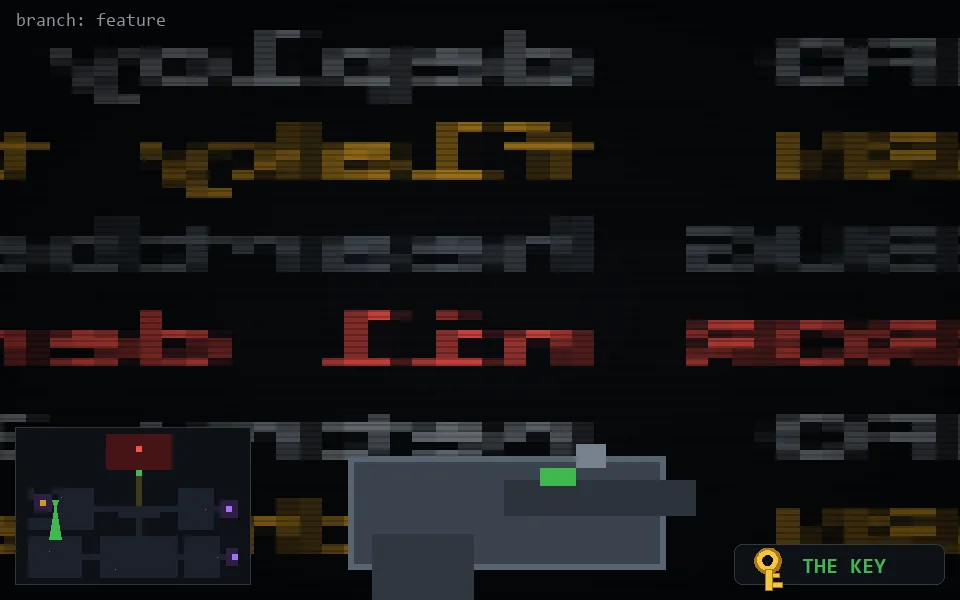

<!-- node:x06y12Sk -->
### `branch: feature` · 📍 (6, 12) · facing S · 🔑 THE KEY

|      |      |      |
|:----:|:----:|:----:|
|      | [⬆️](x06y13Sk.md) |      |
| [⬅️](x06y12Ek.md) | [💥](x06y12Sk.md) | [➡️](x06y12Wk.md) |
|      | [⬇️](x06y11Sk.md) |      |

[⌂ index](../README.md)
