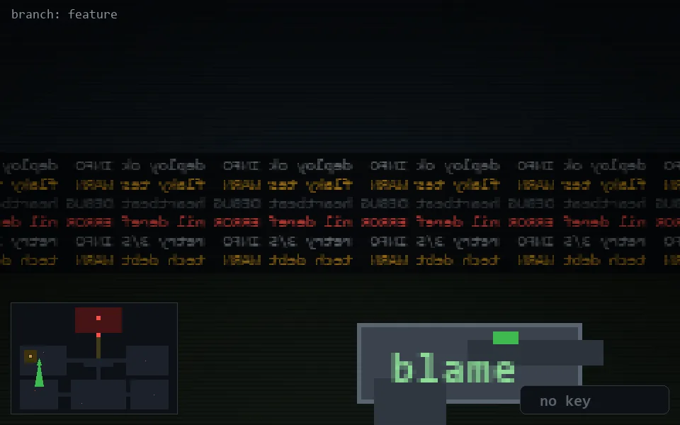

<!-- node:x06y13S -->
### `branch: feature` · 📍 (6, 13) · facing S · 🔑 —

|      |      |      |
|:----:|:----:|:----:|
|      | [⬆️](x06y14S.md) |      |
| [⬅️](x06y13E.md) | [💥](x06y13S.md) | [➡️](x06y13W.md) |
|      | [⬇️](x06y12S.md) |      |

[⌂ index](../README.md)
