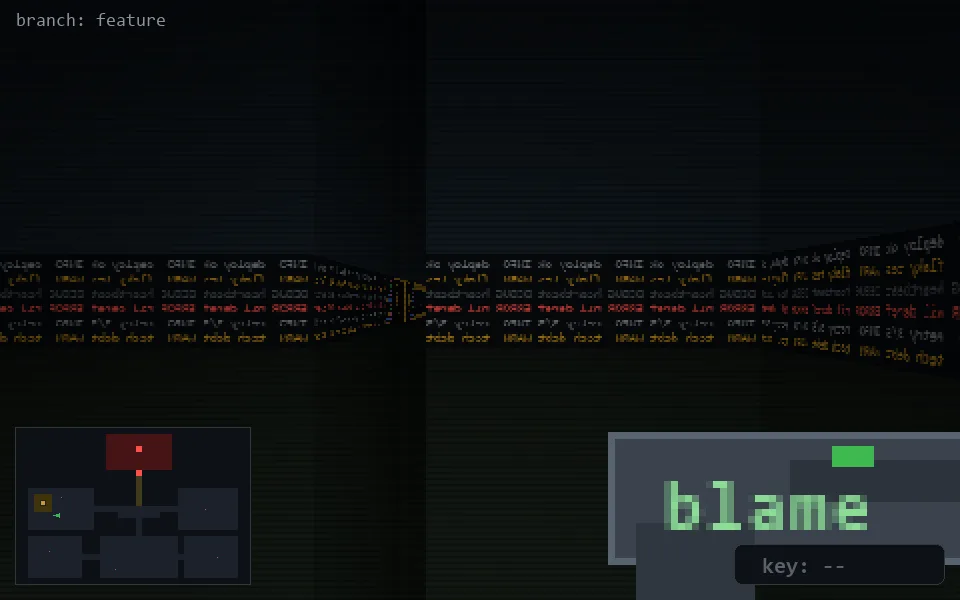

<!-- node:x06y14E -->
### `branch: feature` · 📍 (6, 14) · facing E · 🔑 —

|      |      |      |
|:----:|:----:|:----:|
|      | [⬆️](x07y14E.md) |      |
| [⬅️](x06y14N.md) | [💥](x06y14Ed.md) | [➡️](x06y14S.md) |
|      | ⛔️ |      |

[⌂ index](../README.md)
