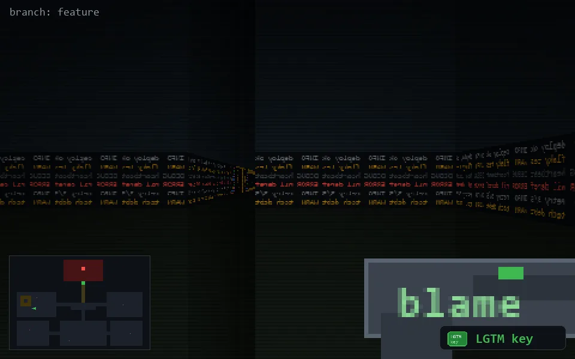

<!-- node:x06y14Ek -->
### `branch: feature` · 📍 (6, 14) · facing E · 🔑 THE KEY

|      |      |      |
|:----:|:----:|:----:|
|      | [⬆️](x07y14Ek.md) |      |
| [⬅️](x06y14Nk.md) | [💥](x06y14Ekd.md) | [➡️](x06y14Sk.md) |
|      | ⛔️ |      |

[⌂ index](../README.md)
