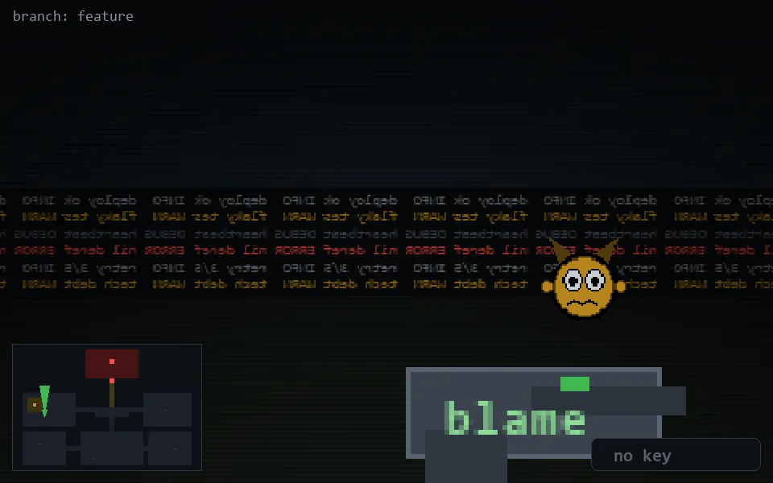

<!-- node:x06y14N -->
### `branch: feature` · 📍 (6, 14) · facing N · 🔑 —

|      |      |      |
|:----:|:----:|:----:|
|      | ⛔️ |      |
| [⬅️](x06y14W.md) | [💥](x06y14Nd.md) | [➡️](x06y14E.md) |
|      | [⬇️](x06y15N.md) |      |

[⌂ index](../README.md)
