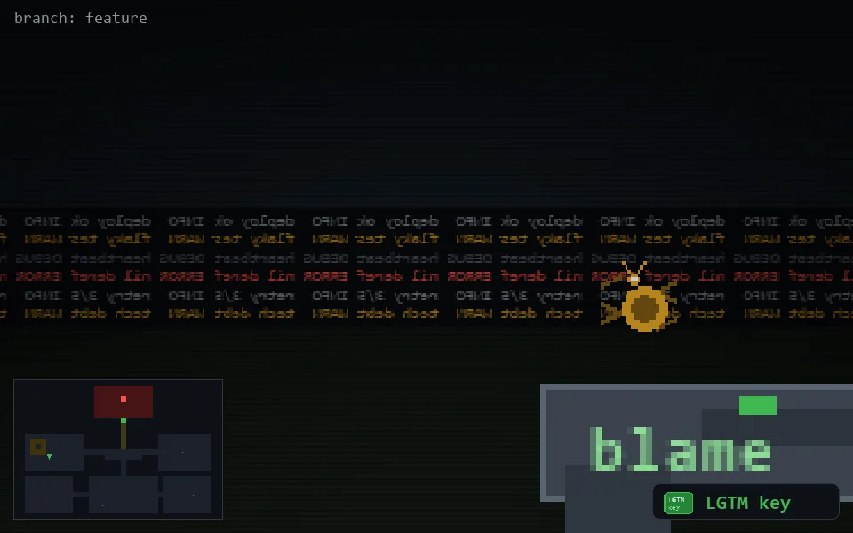

<!-- node:x06y14Nk -->
### `branch: feature` · 📍 (6, 14) · facing N · 🔑 THE KEY

|      |      |      |
|:----:|:----:|:----:|
|      | ⛔️ |      |
| [⬅️](x06y14Wk.md) | [💥](x06y14Nkd.md) | [➡️](x06y14Ek.md) |
|      | [⬇️](x06y15Nk.md) |      |

[⌂ index](../README.md)
