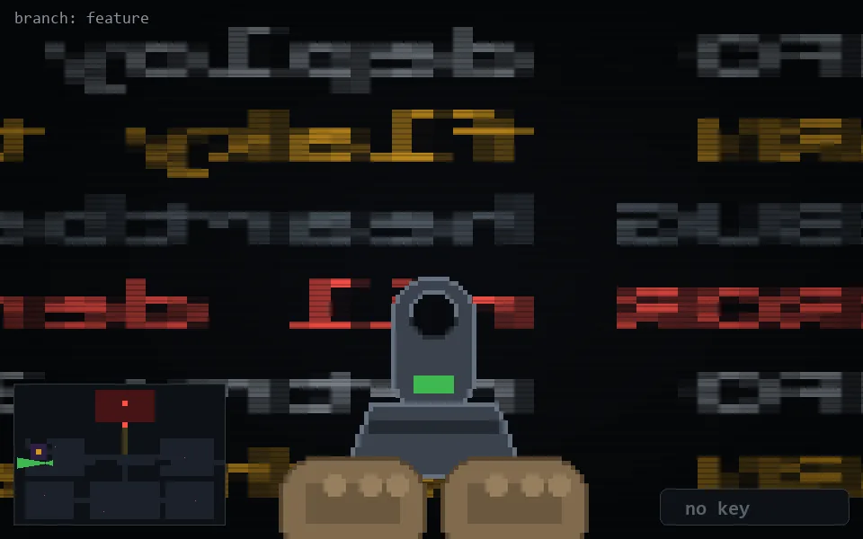

<!-- node:x06y14Wd -->
### `branch: feature` · 📍 (6, 14) · facing W · 🔑 — · ✖ bug deleted (it will be back)

|      |      |      |
|:----:|:----:|:----:|
|      | ⛔️ |      |
| [⬅️](x06y14Sd.md) | [💥](x06y14Wd.md) | [➡️](x06y14Nd.md) |
|      | [⬇️](x07y14Wd.md) |      |

[⌂ index](../README.md)
