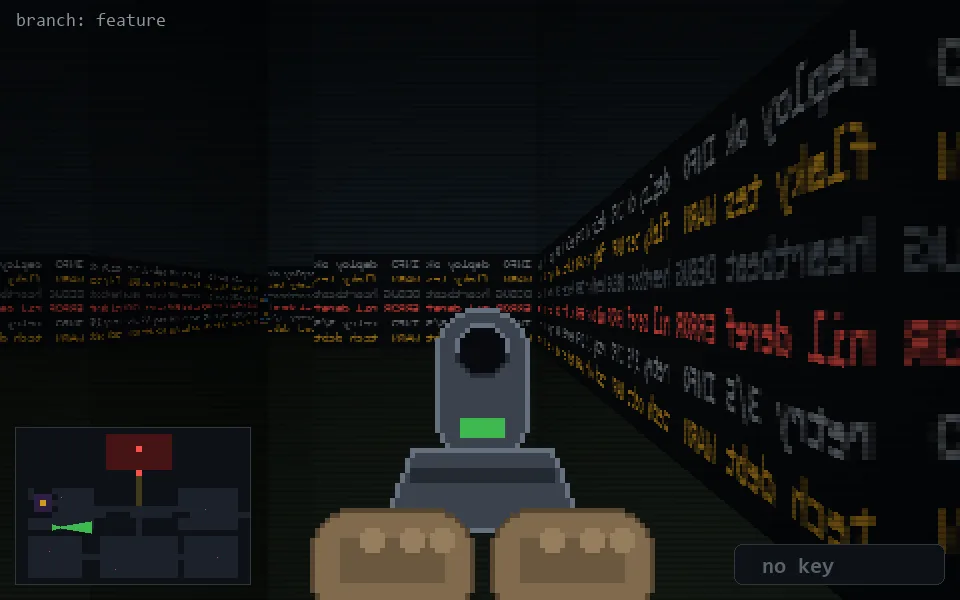

<!-- node:x06y16Ed -->
### `branch: feature` · 📍 (6, 16) · facing E · 🔑 — · ✖ bug deleted (it will be back)

|      |      |      |
|:----:|:----:|:----:|
|      | [⬆️](x07y16Ed.md) |      |
| [⬅️](x06y16Nd.md) | [💥](x06y16Ed.md) | [➡️](x06y16Sd.md) |
|      | [⬇️](x05y16Ed.md) |      |

[⌂ index](../README.md)
