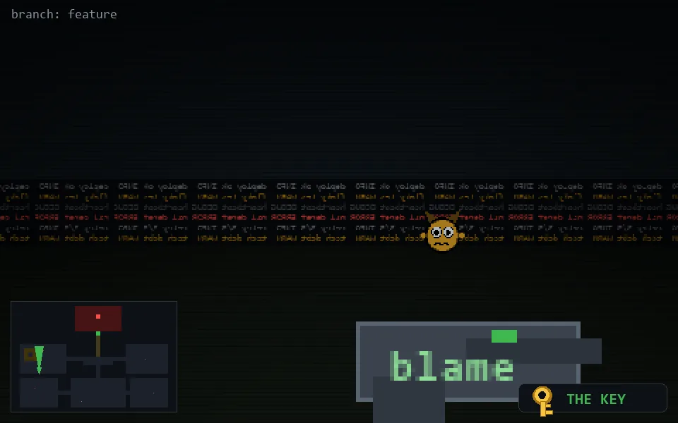

<!-- node:x06y16Nk -->
### `branch: feature` · 📍 (6, 16) · facing N · 🔑 LGTM

|      |      |      |
|:----:|:----:|:----:|
|      | [⬆️](x06y15Nk.md) |      |
| [⬅️](x06y16Wk.md) | [💥](x06y16Nk.md) | [➡️](x06y16Ek.md) |
|      | ⛔️ |      |

[⌂ index](../README.md)
