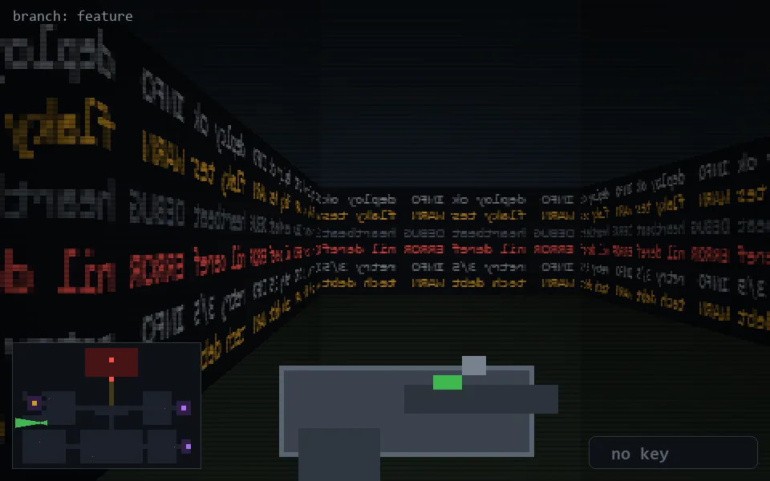

<!-- node:x06y16W -->
### `branch: feature` · 📍 (6, 16) · facing W · 🔑 —

|      |      |      |
|:----:|:----:|:----:|
|      | [⬆️](x05y16W.md) |      |
| [⬅️](x06y16S.md) | [💥](x06y16Wd.md) | [➡️](x06y16N.md) |
|      | [⬇️](x07y16W.md) |      |

[⌂ index](../README.md)
