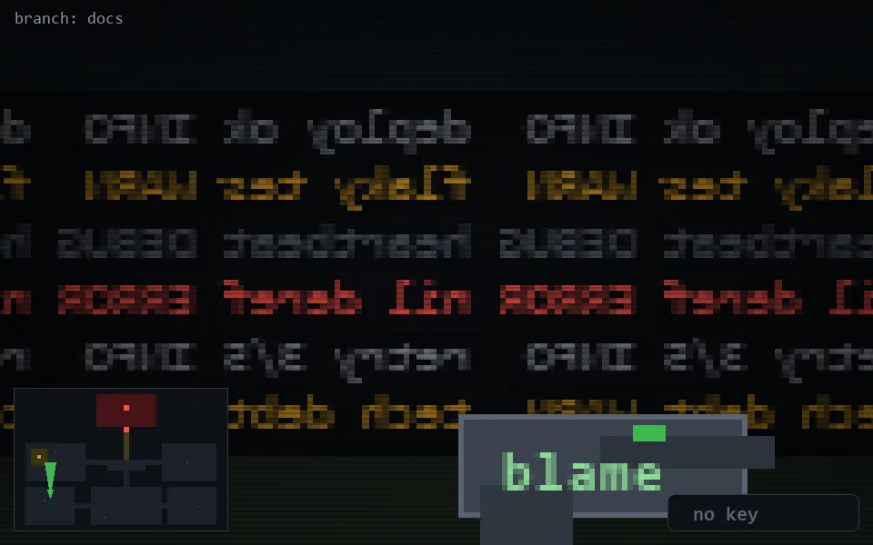

<!-- node:x06y19N -->
### `branch: docs` · 📍 (6, 19) · facing N · 🔑 —

|      |      |      |
|:----:|:----:|:----:|
|      | [⬆️](x06y18N.md) |      |
| [⬅️](x06y19W.md) | [💥](x06y19Nd.md) | [➡️](x06y19E.md) |
|      | [⬇️](x06y20N.md) |      |

[⌂ index](../README.md)
