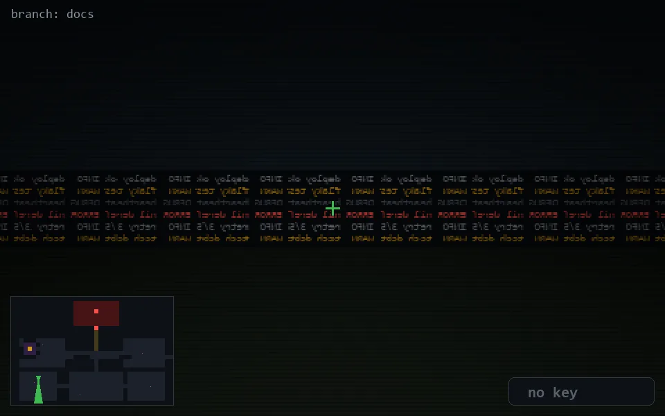

<!-- node:x06y19Sd -->
### `branch: docs` · 📍 (6, 19) · facing S · 🔑 — · ✖ bug deleted (it will be back)

|      |      |      |
|:----:|:----:|:----:|
|      | [⬆️](x06y20Sd.md) |      |
| [⬅️](x06y19Ed.md) | [💥](x06y19Sd.md) | [➡️](x06y19Wd.md) |
|      | [⬇️](x06y18Sd.md) |      |

[⌂ index](../README.md)
