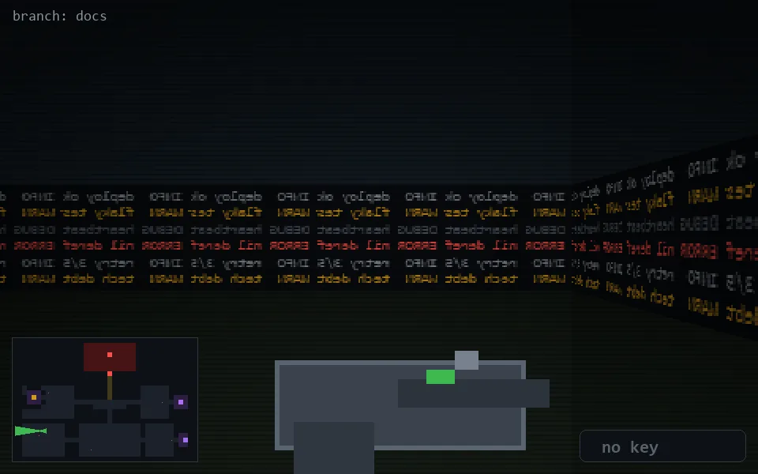

<!-- node:x06y19W -->
### `branch: docs` · 📍 (6, 19) · facing W · 🔑 —

|      |      |      |
|:----:|:----:|:----:|
|      | [⬆️](x05y19W.md) |      |
| [⬅️](x06y19S.md) | [💥](x06y19Wd.md) | [➡️](x06y19N.md) |
|      | [⬇️](x07y19W.md) |      |

[⌂ index](../README.md)
