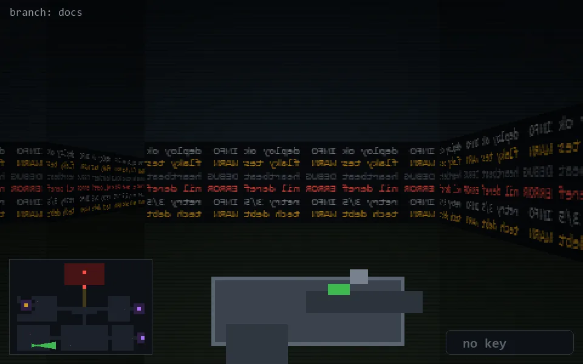

<!-- node:x06y23E -->
### `branch: docs` · 📍 (6, 23) · facing E · 🔑 —

|      |      |      |
|:----:|:----:|:----:|
|      | [⬆️](x07y23E.md) |      |
| [⬅️](x06y23N.md) | [💥](x06y23Ed.md) | [➡️](x06y23S.md) |
|      | [⬇️](x05y23E.md) |      |

[⌂ index](../README.md)
