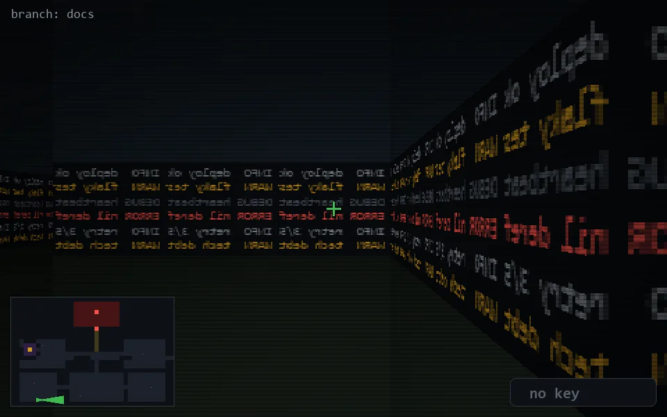

<!-- node:x06y24E -->
### `branch: docs` · 📍 (6, 24) · facing E · 🔑 —

|      |      |      |
|:----:|:----:|:----:|
|      | [⬆️](x07y24E.md) |      |
| [⬅️](x06y24N.md) | [💥](x06y24Ed.md) | [➡️](x06y24S.md) |
|      | [⬇️](x05y24E.md) |      |

[⌂ index](../README.md)
