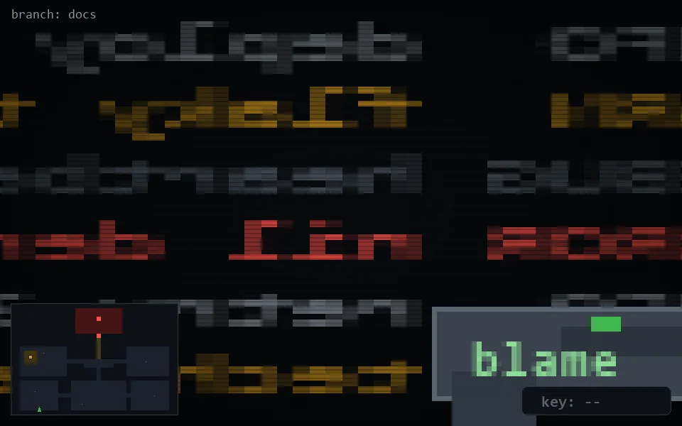

<!-- node:x06y24S -->
### `branch: docs` · 📍 (6, 24) · facing S · 🔑 —

|      |      |      |
|:----:|:----:|:----:|
|      | ⛔️ |      |
| [⬅️](x06y24E.md) | [💥](x06y24S.md) | [➡️](x06y24W.md) |
|      | [⬇️](x06y23S.md) |      |

[⌂ index](../README.md)
