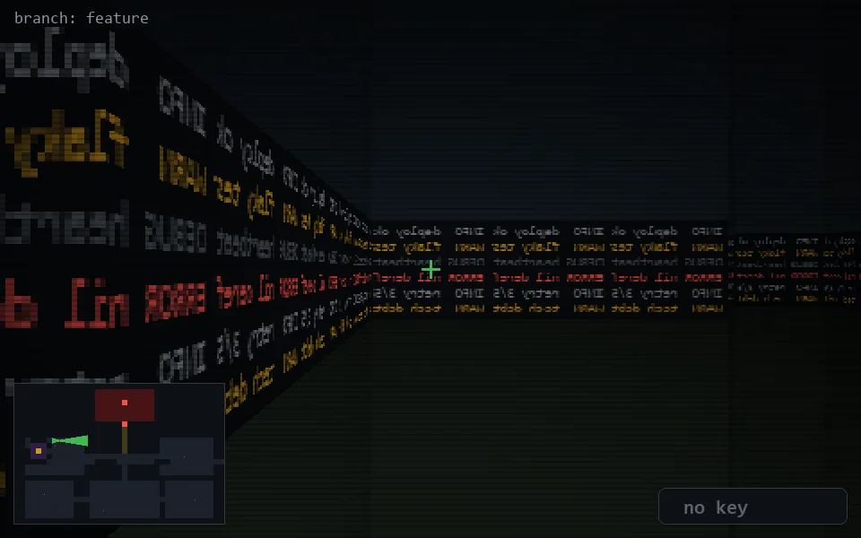

<!-- node:x07y10Ed -->
### `branch: feature` · 📍 (7, 10) · facing E · 🔑 — · ✖ bug deleted (it will be back)

|      |      |      |
|:----:|:----:|:----:|
|      | [⬆️](x08y10Ed.md) |      |
| [⬅️](x07y10Nd.md) | [💥](x07y10Ed.md) | [➡️](x07y10Sd.md) |
|      | [⬇️](x06y10Ed.md) |      |

[⌂ index](../README.md)
