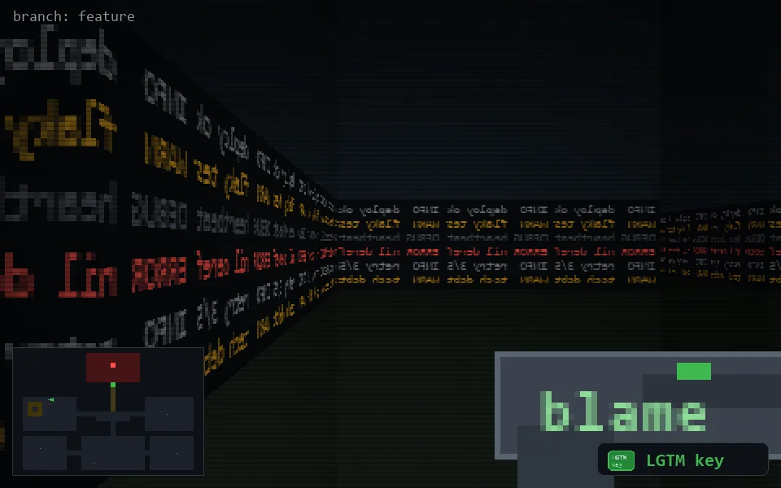

<!-- node:x07y10Ek -->
### `branch: feature` · 📍 (7, 10) · facing E · 🔑 LGTM

|      |      |      |
|:----:|:----:|:----:|
|      | [⬆️](x08y10Ek.md) |      |
| [⬅️](x07y10Nk.md) | [💥](x07y10Ek.md) | [➡️](x07y10Sk.md) |
|      | [⬇️](x06y10Ek.md) |      |

[⌂ index](../README.md)
