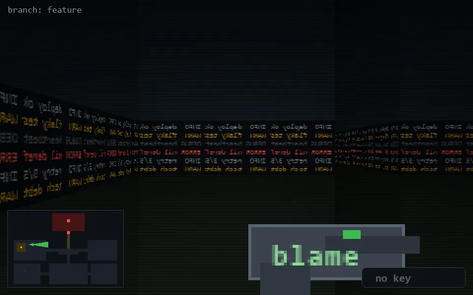

<!-- node:x07y11E -->
### `branch: feature` · 📍 (7, 11) · facing E · 🔑 —

|      |      |      |
|:----:|:----:|:----:|
|      | [⬆️](x08y11E.md) |      |
| [⬅️](x07y11N.md) | [💥](x07y11Ed.md) | [➡️](x07y11S.md) |
|      | ⛔️ |      |

[⌂ index](../README.md)
