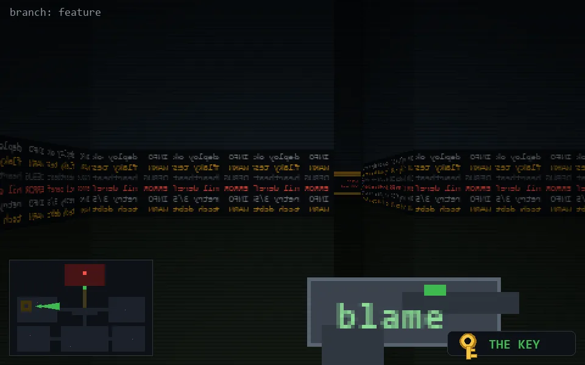

<!-- node:x07y12Ek -->
### `branch: feature` · 📍 (7, 12) · facing E · 🔑 LGTM

|      |      |      |
|:----:|:----:|:----:|
|      | [⬆️](x08y12Ek.md) |      |
| [⬅️](x07y12Nk.md) | [💥](x07y12Ek.md) | [➡️](x07y12Sk.md) |
|      | [⬇️](x06y12Ek.md) |      |

[⌂ index](../README.md)
