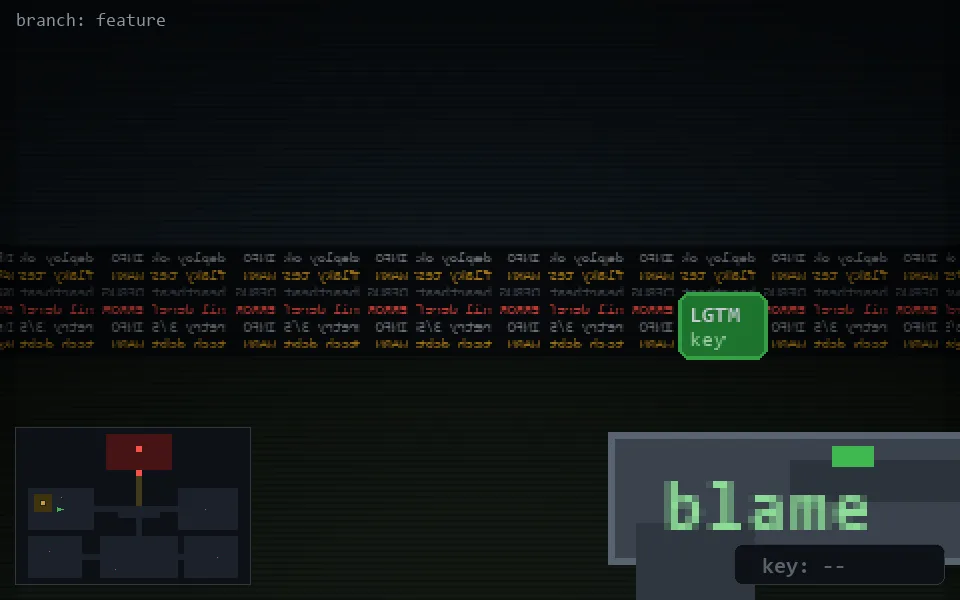

<!-- node:x07y13W -->
### `branch: feature` · 📍 (7, 13) · facing W · 🔑 —

|      |      |      |
|:----:|:----:|:----:|
|      | ⛔️ |      |
| [⬅️](x07y13S.md) | [💥](x07y13W.md) | [➡️](x07y13N.md) |
|      | [⬇️](x08y13W.md) |      |

[⌂ index](../README.md)
