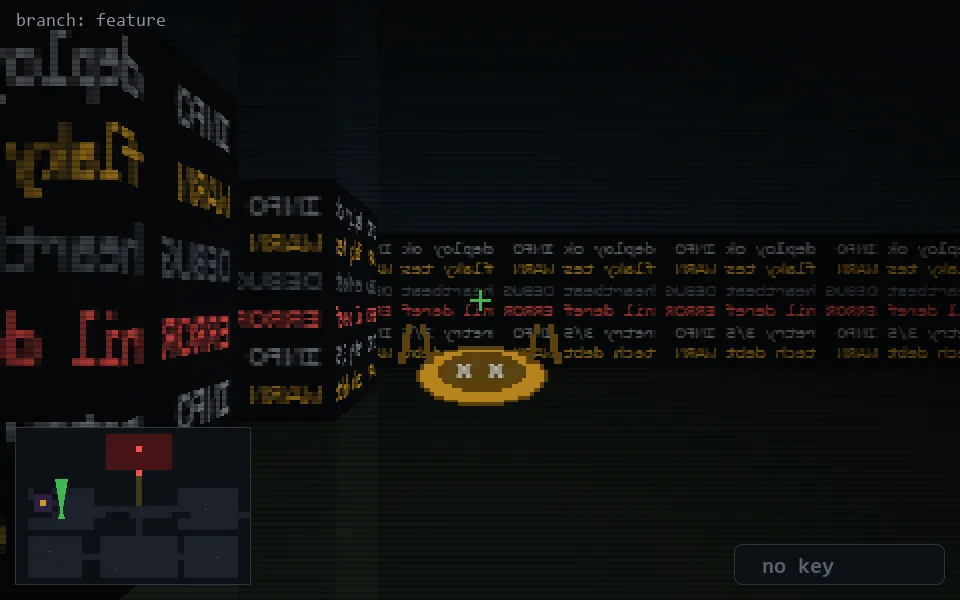

<!-- node:x07y14Nd -->
### `branch: feature` · 📍 (7, 14) · facing N · 🔑 — · ✖ bug deleted (it will be back)

|      |      |      |
|:----:|:----:|:----:|
|      | [⬆️](x07y13Nd.md) |      |
| [⬅️](x07y14Wd.md) | [💥](x07y14Nd.md) | [➡️](x07y14Ed.md) |
|      | [⬇️](x07y15Nd.md) |      |

[⌂ index](../README.md)
