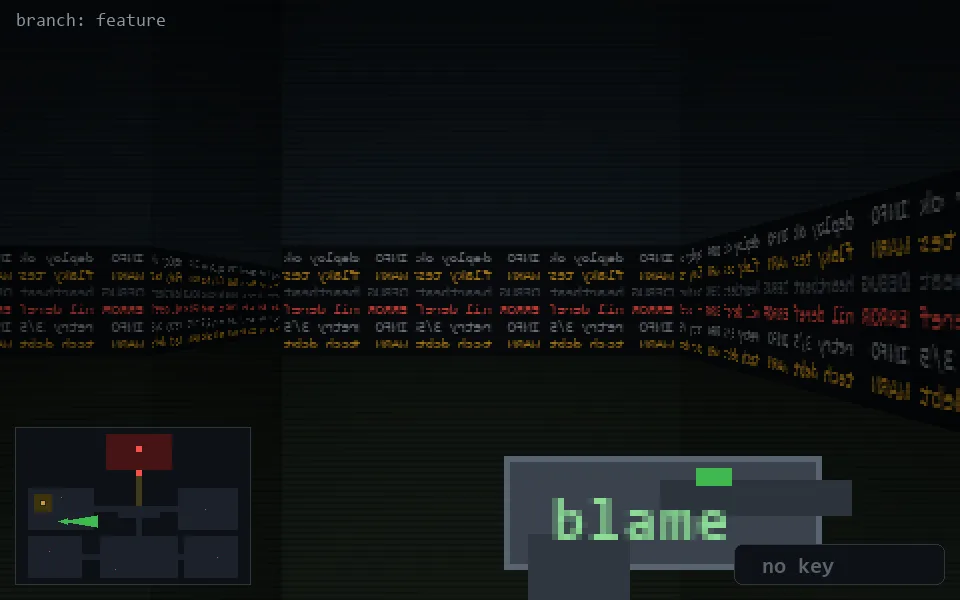

<!-- node:x07y15E -->
### `branch: feature` · 📍 (7, 15) · facing E · 🔑 —

|      |      |      |
|:----:|:----:|:----:|
|      | [⬆️](x08y15E.md) |      |
| [⬅️](x07y15N.md) | [💥](x07y15E.md) | [➡️](x07y15S.md) |
|      | [⬇️](x06y15E.md) |      |

[⌂ index](../README.md)
