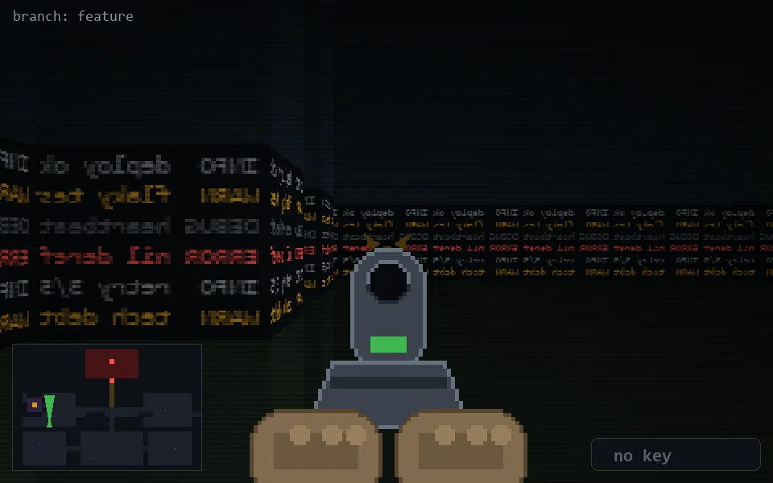

<!-- node:x07y16N -->
### `branch: feature` · 📍 (7, 16) · facing N · 🔑 —

|      |      |      |
|:----:|:----:|:----:|
|      | [⬆️](x07y15N.md) |      |
| [⬅️](x07y16W.md) | [💥](x07y16Nd.md) | [➡️](x07y16E.md) |
|      | ⛔️ |      |

[⌂ index](../README.md)
