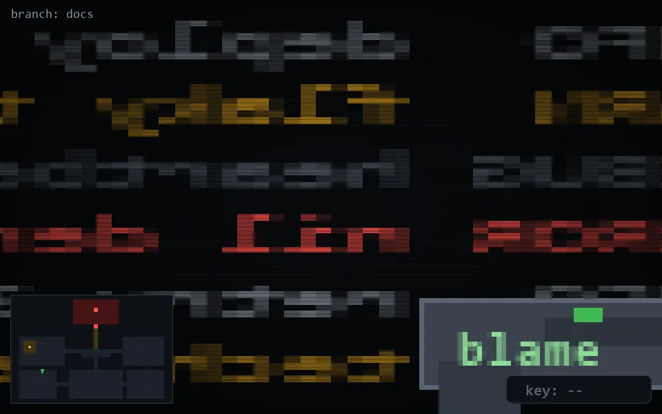

<!-- node:x07y18N -->
### `branch: docs` · 📍 (7, 18) · facing N · 🔑 —

|      |      |      |
|:----:|:----:|:----:|
|      | ⛔️ |      |
| [⬅️](x07y18W.md) | [💥](x07y18Nd.md) | [➡️](x07y18E.md) |
|      | [⬇️](x07y19N.md) |      |

[⌂ index](../README.md)
