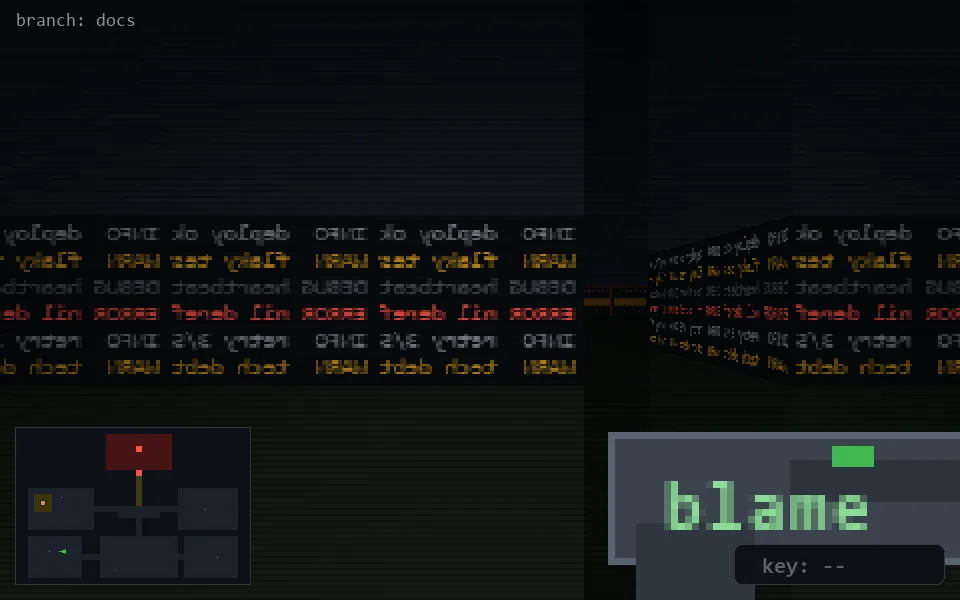

<!-- node:x07y20E -->
### `branch: docs` · 📍 (7, 20) · facing E · 🔑 —

|      |      |      |
|:----:|:----:|:----:|
|      | [⬆️](x08y20E.md) |      |
| [⬅️](x07y20N.md) | [💥](x07y20Ed.md) | [➡️](x07y20S.md) |
|      | [⬇️](x06y20E.md) |      |

[⌂ index](../README.md)
