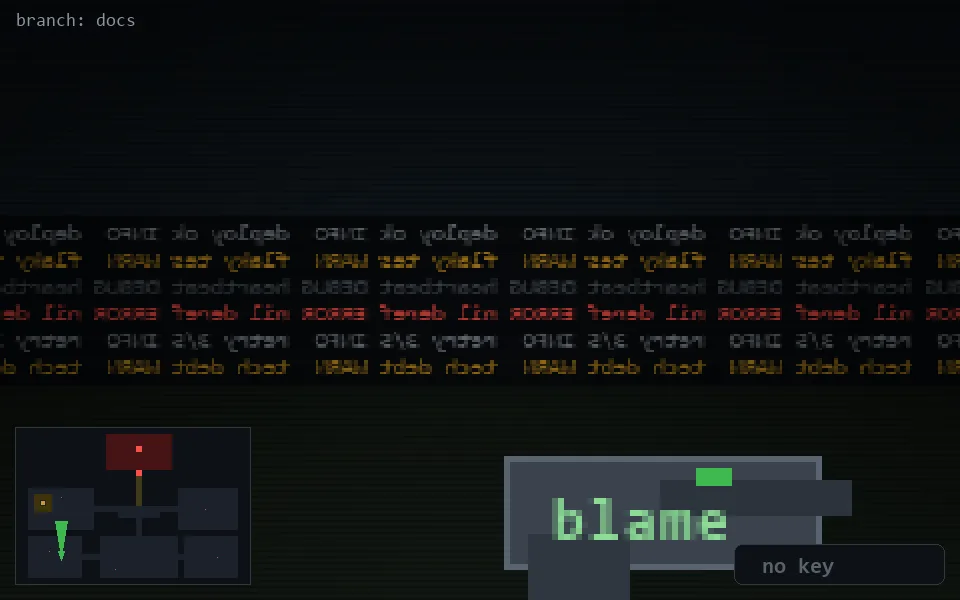

<!-- node:x07y21N -->
### `branch: docs` · 📍 (7, 21) · facing N · 🔑 —

|      |      |      |
|:----:|:----:|:----:|
|      | [⬆️](x07y20N.md) |      |
| [⬅️](x07y21W.md) | [💥](x07y21N.md) | [➡️](x07y21E.md) |
|      | [⬇️](x07y22N.md) |      |

[⌂ index](../README.md)
