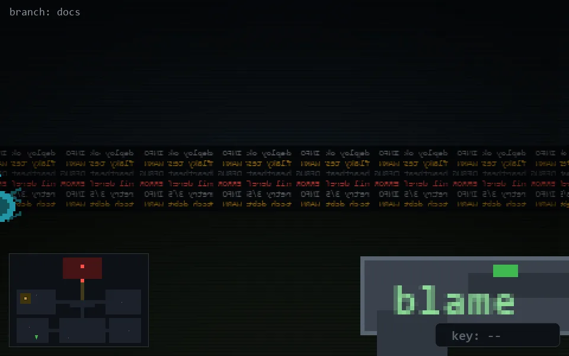

<!-- node:x07y23N -->
### `branch: docs` · 📍 (7, 23) · facing N · 🔑 —

|      |      |      |
|:----:|:----:|:----:|
|      | [⬆️](x07y22N.md) |      |
| [⬅️](x07y23W.md) | [💥](x07y23N.md) | [➡️](x07y23E.md) |
|      | [⬇️](x07y24N.md) |      |

[⌂ index](../README.md)
