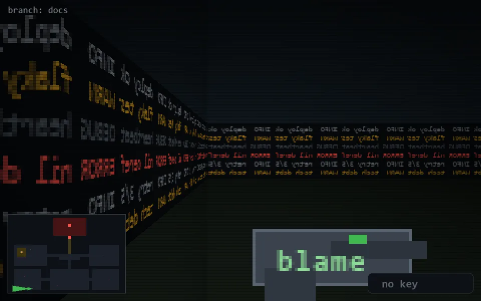

<!-- node:x07y24W -->
### `branch: docs` · 📍 (7, 24) · facing W · 🔑 —

|      |      |      |
|:----:|:----:|:----:|
|      | [⬆️](x06y24W.md) |      |
| [⬅️](x07y24S.md) | [💥](x07y24Wd.md) | [➡️](x07y24N.md) |
|      | [⬇️](x08y24W.md) |      |

[⌂ index](../README.md)
