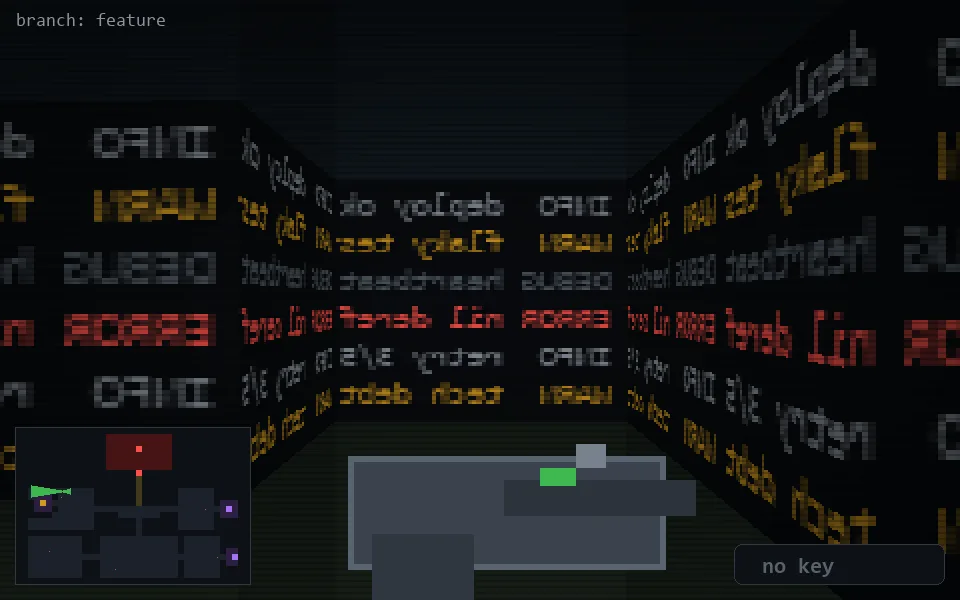

<!-- node:x08y10W -->
### `branch: feature` · 📍 (8, 10) · facing W · 🔑 —

|      |      |      |
|:----:|:----:|:----:|
|      | [⬆️](x07y10W.md) |      |
| [⬅️](x08y10S.md) | [💥](x08y10W.md) | [➡️](x08y10N.md) |
|      | [⬇️](x09y10W.md) |      |

[⌂ index](../README.md)
