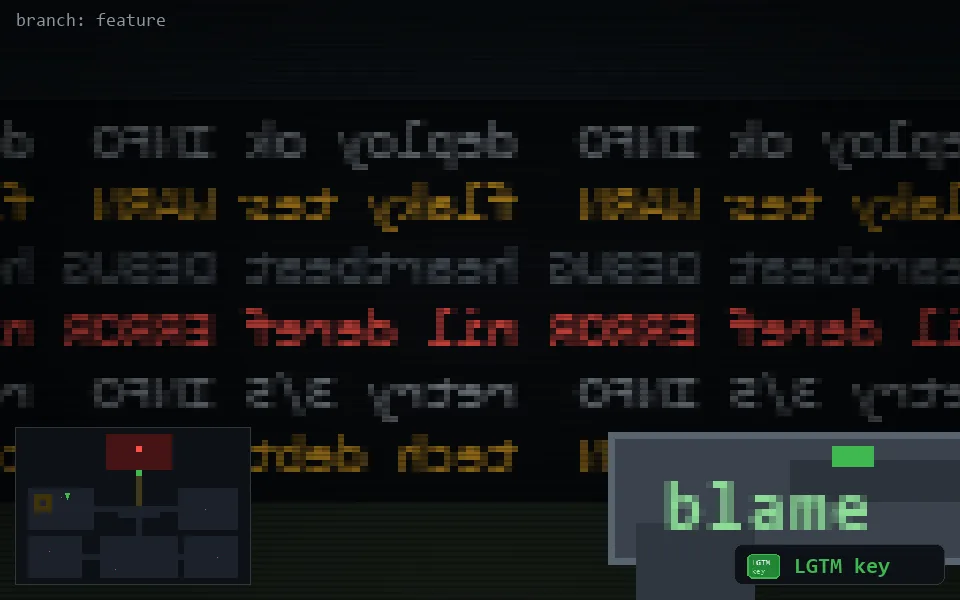

<!-- node:x08y11Nk -->
### `branch: feature` · 📍 (8, 11) · facing N · 🔑 THE KEY

|      |      |      |
|:----:|:----:|:----:|
|      | [⬆️](x08y10Nk.md) |      |
| [⬅️](x08y11Wk.md) | [💥](x08y11Nkd.md) | [➡️](x08y11Ek.md) |
|      | [⬇️](x08y12Nk.md) |      |

[⌂ index](../README.md)
