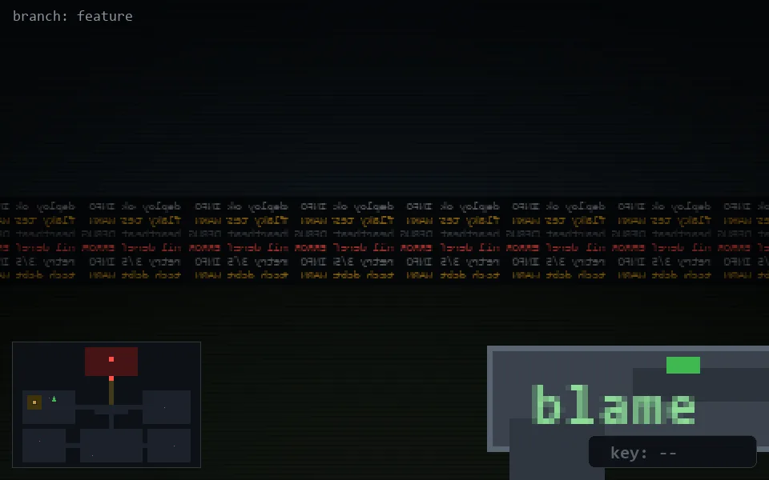

<!-- node:x08y11S -->
### `branch: feature` · 📍 (8, 11) · facing S · 🔑 —

|      |      |      |
|:----:|:----:|:----:|
|      | [⬆️](x08y12S.md) |      |
| [⬅️](x08y11E.md) | [💥](x08y11Sd.md) | [➡️](x08y11W.md) |
|      | [⬇️](x08y10S.md) |      |

[⌂ index](../README.md)
