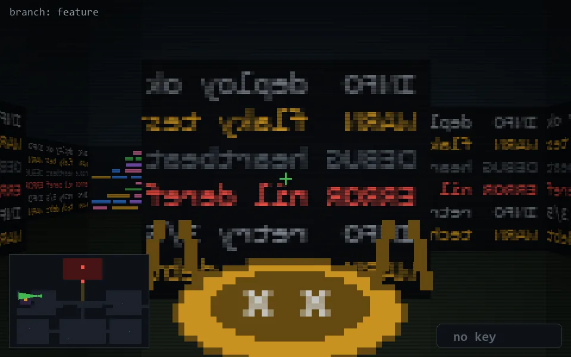

<!-- node:x08y11Wd -->
### `branch: feature` · 📍 (8, 11) · facing W · 🔑 — · ✖ bug deleted (it will be back)

|      |      |      |
|:----:|:----:|:----:|
|      | [⬆️](x07y11Wd.md) |      |
| [⬅️](x08y11Sd.md) | [💥](x08y11Wd.md) | [➡️](x08y11Nd.md) |
|      | [⬇️](x09y11Wd.md) |      |

[⌂ index](../README.md)
