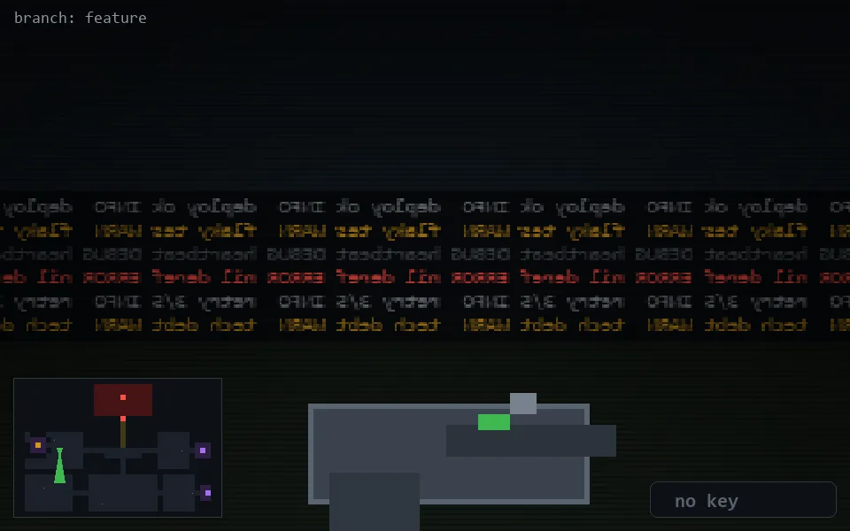

<!-- node:x08y13S -->
### `branch: feature` · 📍 (8, 13) · facing S · 🔑 —

|      |      |      |
|:----:|:----:|:----:|
|      | [⬆️](x08y14S.md) |      |
| [⬅️](x08y13E.md) | [💥](x08y13Sd.md) | [➡️](x08y13W.md) |
|      | [⬇️](x08y12S.md) |      |

[⌂ index](../README.md)
