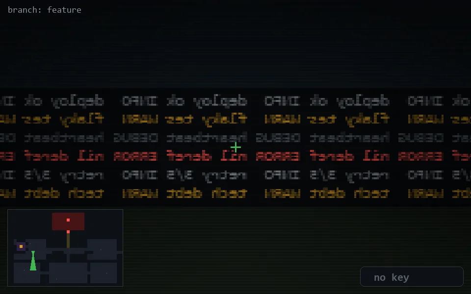

<!-- node:x08y14S -->
### `branch: feature` · 📍 (8, 14) · facing S · 🔑 —

|      |      |      |
|:----:|:----:|:----:|
|      | [⬆️](x08y15S.md) |      |
| [⬅️](x08y14E.md) | [💥](x08y14S.md) | [➡️](x08y14W.md) |
|      | [⬇️](x08y13S.md) |      |

[⌂ index](../README.md)
