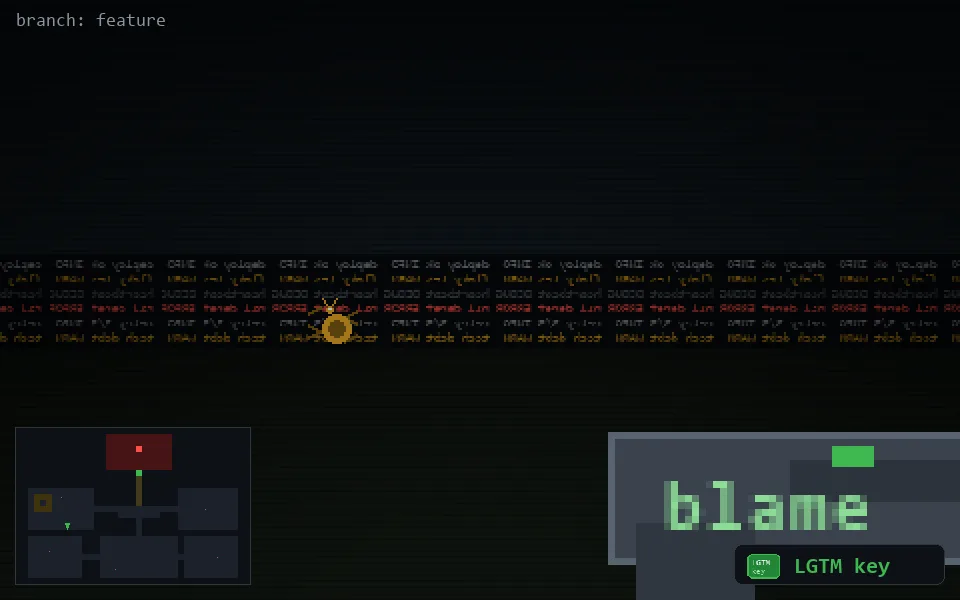

<!-- node:x08y16Nk -->
### `branch: feature` · 📍 (8, 16) · facing N · 🔑 LGTM

|      |      |      |
|:----:|:----:|:----:|
|      | [⬆️](x08y15Nk.md) |      |
| [⬅️](x08y16Wk.md) | [💥](x08y16Nk.md) | [➡️](x08y16Ek.md) |
|      | ⛔️ |      |

[⌂ index](../README.md)
