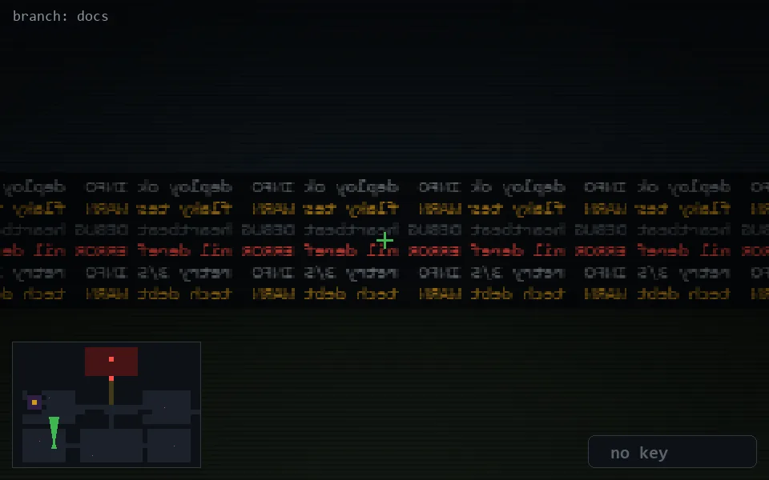

<!-- node:x08y21N -->
### `branch: docs` · 📍 (8, 21) · facing N · 🔑 —

|      |      |      |
|:----:|:----:|:----:|
|      | [⬆️](x08y20N.md) |      |
| [⬅️](x08y21W.md) | [💥](x08y21Nd.md) | [➡️](x08y21E.md) |
|      | [⬇️](x08y22N.md) |      |

[⌂ index](../README.md)
