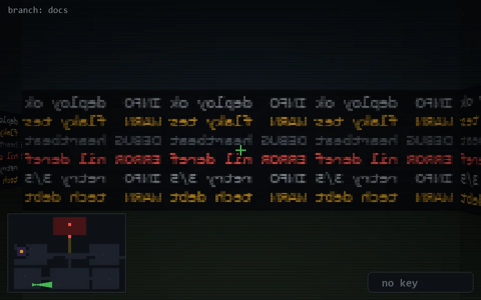

<!-- node:x08y23E -->
### `branch: docs` · 📍 (8, 23) · facing E · 🔑 —

|      |      |      |
|:----:|:----:|:----:|
|      | [⬆️](x09y23E.md) |      |
| [⬅️](x08y23N.md) | [💥](x08y23E.md) | [➡️](x08y23S.md) |
|      | [⬇️](x07y23E.md) |      |

[⌂ index](../README.md)
