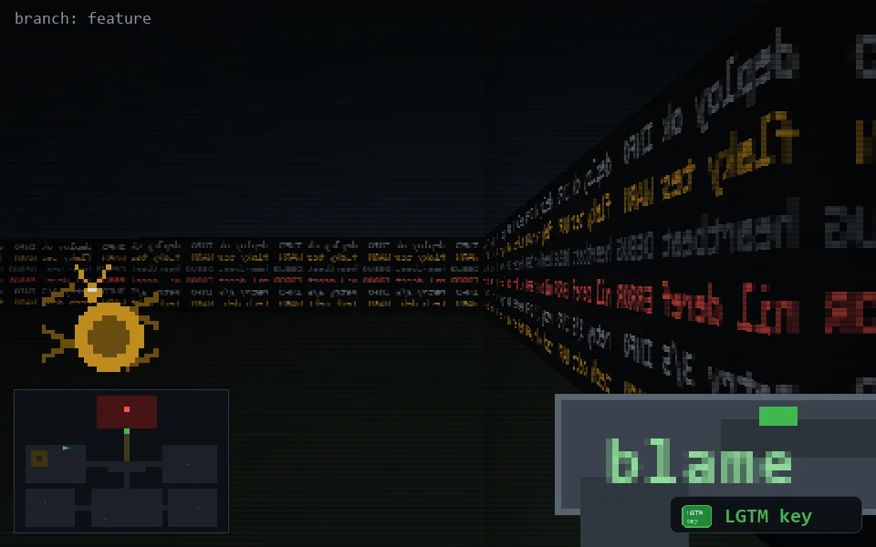

<!-- node:x09y10Wk -->
### `branch: feature` · 📍 (9, 10) · facing W · 🔑 THE KEY

|      |      |      |
|:----:|:----:|:----:|
|      | [⬆️](x08y10Wk.md) |      |
| [⬅️](x09y10Sk.md) | [💥](x09y10Wkd.md) | [➡️](x09y10Nk.md) |
|      | [⬇️](x10y10Wk.md) |      |

[⌂ index](../README.md)
