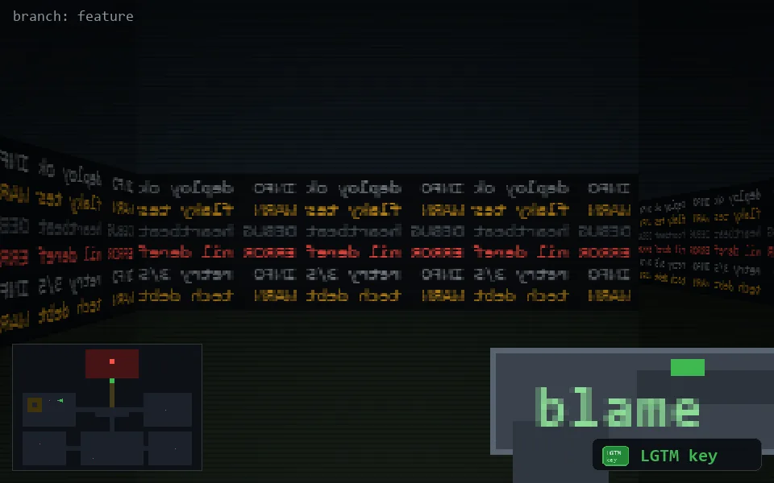

<!-- node:x09y11Ek -->
### `branch: feature` · 📍 (9, 11) · facing E · 🔑 LGTM

|      |      |      |
|:----:|:----:|:----:|
|      | [⬆️](x10y11Ek.md) |      |
| [⬅️](x09y11Nk.md) | [💥](x09y11Ek.md) | [➡️](x09y11Sk.md) |
|      | [⬇️](x08y11Ek.md) |      |

[⌂ index](../README.md)
